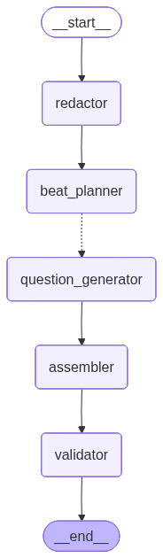

# Agent Graph Overview

The agent system is built as a LangGraph workflow that transforms raw user input into polished, validated questions through a series of structured nodes.

## Graph Structure

## Inputs
* Target scholarship name
* Target scholarship type
* User's one-sentence personal parable
* User's three resume bullet points

## Outputs
* A structured list of clear, relevant, and thought-provoking questions tailored to the user's application
* Attached text boxes

## Agent Nodes

Redactor Agent
* Input: raw user text
* Output: redacted text + detected PII spans

Beat Planner Agent
* Input: redacted text + scholarship/program type
* Output: beats list + “what’s missing per beat”

Parallel Question Agents (phased parallel)
  * Run in parallel per beat:
    * Fit Agent
    * Evidence/Metrics Agent
    * Impact Agent
    * Character/Reflection Agent

Assembler Agent
  * Dedupes questions across beats
  * Ensures distribution requirements (e.g., ≥1 metric question, ≥1 tradeoff question)
  * Outputs final grouped question packs
  * With parallel question agents, these parts follow a Map-reduce pattern to handle each beat independently and then aggregate results

Validator Agent
  * Checks for question formatting.
  * Ensures the pronouns and metrics in questions align with the user's redacted input.